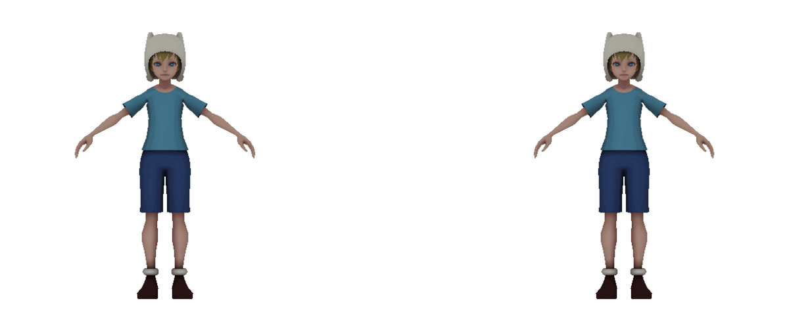
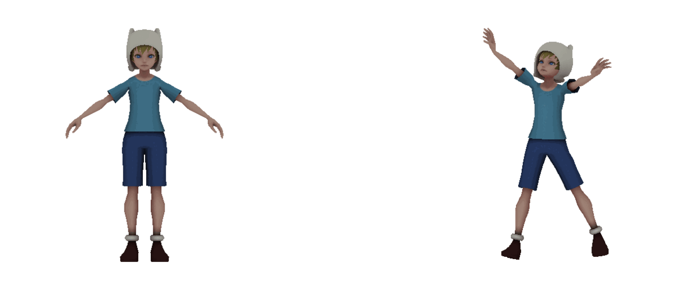

# MMData: manipulate MMD models and get lots of training data


MMData is a tool to manipulate PMX (MikuMikuDance) models with VMD (Vocaloid Motion Data) files.
You can use it to pose a character model with various poses for fun.


In addition, this tool can generate a huge dataset for training 3D mesh reconstruction models,
such as PIFu or PaMIR.


After generating lots of data, time to head for a mesh reconstruction model
(for example, [PaMIR](https://github.com/ZhengZerong/PaMIR)) and train your model!
I used this tool to train a mesh reconstruction model for Japanese anime characters in a past project.


## Installation
Firstly, we need to install necessary packages:
```
sudo apt update
sudo apt install gcc build-essential libopenexr-dev libglu1-mesa-dev freeglut3-dev mesa-common-dev openexr
```
Then, install the Python libraries in the `reuirements.txt` file:
```
pip install -r requirements.txt
```


## Folder structure
Suppose that we have the following structure:
<ul>
    <li>pmx_data
        <ul>
            <li>{model_name_01}
                <ul>
                    <li>{model_name_01}.pmx</li>
                    <li>texture files</li>
                </ul>
            </li>
            <li>{model_name_02}
                <ul>
                    <li>{model_name_02}.pmx</li>
                    <li>texture files</li>
                </ul>
            </li>
            <li>...</li>
        </ul>
    </li>
    <li>mesh_output
        <ul>
            <li>{model_name_01}
                <ul>
                    <li>{model_name_01}.obj</li>
                    <li>texture and PRT files</li>
                </ul>
            </li>
            <li>{model_name_02}
                <ul>
                    <li>{model_name_02}.obj</li>
                    <li>texture and PRT files</li>
                </ul>
            </li>
            <li>...</li>
        </ul>
    </li>
    <li>image_output
        <ul>
            <li>{model_name_01}
                <ul>
                    <li>color</li>
                    <li>color_uv</li>
                    <li>mask</li>
                    <li>meta</li>
                </ul>
            </li>
            <li>{model_name_02}
                <ul>
                    <li>...</li>
                </ul>
            </li>
            <li>...</li>
        </ul>
    </li>
    <li>motion.vmd</li>
</ul>

The structure of `image_data` follows the same structure as PaMIR's training data.


## Usage
To pose a PMX model with a VMD file, we use:

`$ mmdata pose`
* `--pmx`, `-p`: path to the PMX model file
* `--vmd`, `-v`: path to the VMD motion file
* `--timestamp`, `-t`: timestamp in VMD file
* `--output_dir`, `-o`: path to output directory
* `--no_display`: flag to prevent displaying the pose output

Example:
```
mmdata pose -p ./pmx_data/A/A.pmx -v ./motion.vmd -t 10.0 -o ./mesh_output
```

To generate mesh reconstruction training data, we use:

`$ mmdata gen`
* `--pmx_dir`, `-p`: path to the PMX directories
* `--vmd`, `-v`: path to the VMD motion file
* `--timestamp`, `-t`: timestamp in VMD file
* `--mesh_dir`, `-m`: path to the OBJ directories
* `--image_dir`, `-i`: path to the directory of output images

Example:
```
mmdata gen -p ./pmx_data -v ./motion.vmd -t 10.0 -m ./mesh_output -i ./image_output
```


# License
[MIT License](LICENSE)
